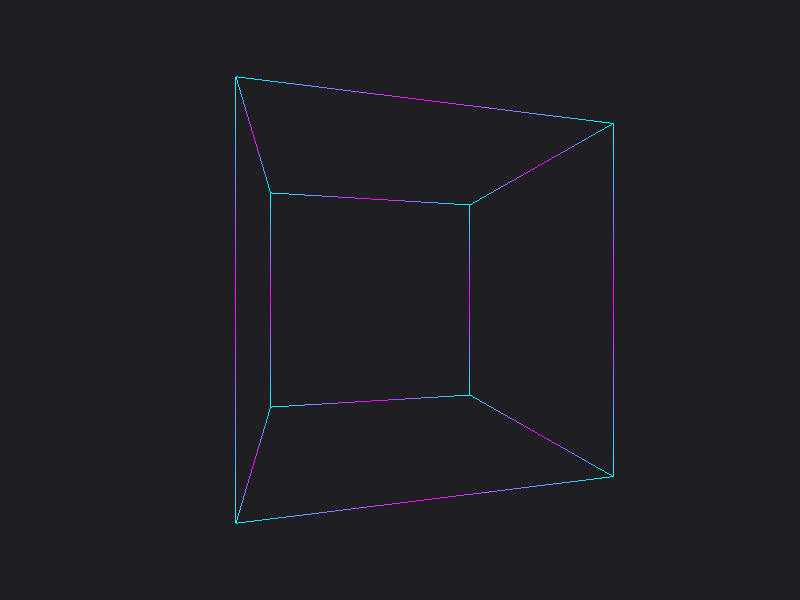
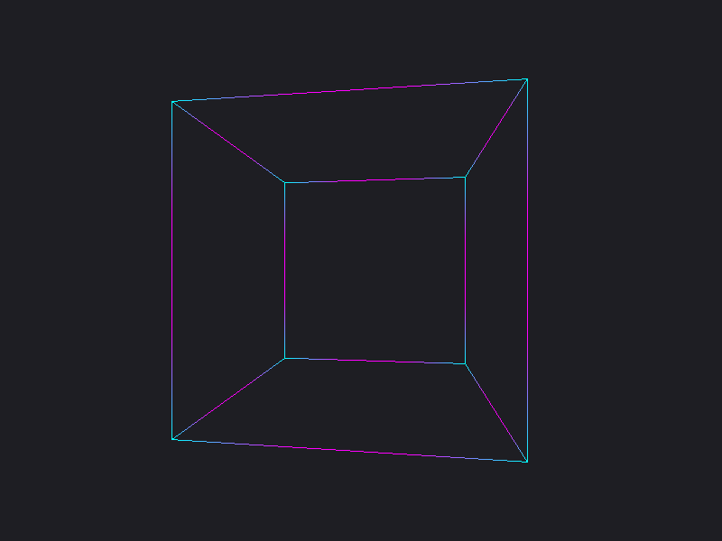

# Documentazione e Avanzamento Progetto

In questa sezione viene documentata manualmente l'evoluzione passo dopo passo del progetto **Tu-Maze**, mappando ogni release milestone (*tappa minor*) con le relative modifiche strutturali, grafiche e algoritmiche introdotte.

## Tappa v0.1.x (Stage 01) - Fondamenta del Progetto e Proiezione Spaziale 3D

**Descrizione dell'avanzamento**:

In questa prima veste iniziale del progetto, l'obiettivo primario è stato l'abbandono dei layout bidimensionali piatti a favore dell'impostazione dell'infrastruttura grafica hardware-accelerata. È stata configurata la finestra di rendering reattiva accoppiata all'ecosistema di eventi moderno di SFML 3.0 e integrata la matematica dei vettori tramite la libreria GLM.

**Principali modifiche introdotte**:

- **Integrazione SFML 3.0 & GLM:** Configurazione dell'ambiente di compilazione centralizzato tramite `FetchContent` in CMake per scaricare e linkare le dipendenze grafiche ed evitare configurazioni locali macchinose.
- **Motore di Proiezione Prospettica:** Introduzione dei primi calcoli di proiezione spaziale 3D nativa nel piano bidimensionale dello schermo, sfruttando la formula matematica: $$x' = \frac{x}{z}, \quad y' = \frac{y}{z}$$
- **Pipeline di Animazione Costante:** Implementazione delle funzioni ausiliarie isolando la logica di calcolo (`animatePoint` e `projectPoint`) accoppiate a un `sf::Clock` per indurre rotazioni continue lungo l'asse Y con velocità angolare costante e lineare nel tempo, indipendente dal framerate della macchina ospite.
- **Rendering a Spigoli Bicolore (Cyberpunk):** Disegno a schermo degli spigoli del cubo proiettato mediante linee a gradiente bicolore ciano e magenta. La geometria dei segmenti viene spezzata a metà per garantire che i vertici mantengano sempre il colore ciano puro, mentre il centro esatto di ciascun lato sfumi in magenta radiante.
- **Automazione CI/CD:** Configurazione delle GitHub Actions con matrici di build multi-OS e automazione dei rilasci semantici tramite `release-please`.

**Screenshots**:

Rendering del cubo colorato:

Animazione del cubo:
<video alt="Stage 01 - Cube Rotation Demo" src="resources/screenshots/stage01-rotation.mp4" controls autoplay loop muted width="100%"></video>

## Tappa v0.2.x (Stage 02) - Perfezionamento Estetico e Strutturazione del Progetto

**Descrizione dell'avanzamento**:

In questa tappa il lavoro si è concentrato sul raffinamento visivo del rendering e sulla riorganizzazione strutturale della repository per facilitarne la documentazione e la distribuzione. È stata perfezionata la resa cromatica degli spigoli del cubo ed è stata completata la configurazione dei file di supporto, dei dettagli di packaging e degli script di esportazione del binario.

**Principali modifiche introdotte**:

- **Rendering degli Spigoli a Tre Segmenti:** Ottimizzazione del disegno dei lati del cubo tramite la suddivisione di ogni spigolo in tre sezioni distinte (0-1/3, 1/3-2/3, 2/3-1). I tratti iniziali e finali presentano una sfumatura progressiva tra ciano e magenta, mentre la parte centrale (da 1/3 a 2/3) mantiene un colore magenta solido e uniforme.
- **Ridenominazione dell'Eseguibile e Packaging:** Modifica del nome del file eseguibile in 'cube' e contestuale aggiornamento di tutti i dettagli di configurazione e pacchettizzazione del progetto.
- **Potenziamento del README:** Ampliamento del file di panoramica principale con l'aggiunta di istruzioni dettagliate per l'installazione e una presentazione chiara del progetto.
- **Automazione dello Script di Export:** Aggiornamento della pipeline di esportazione per includere la copia automatica degli asset richiesti e della documentazione di supporto all'interno della build finale.
- **Integrazione di Screenshot e Demo Video:** Inclusione di nuovi elementi multimediali esplicativi direttamente nella repository, tra cui catture schermata aggiornate e un video dimostrativo del cubo in funzione.

**Screenshots**:

Rendering del cubo con i nuovi colori:

